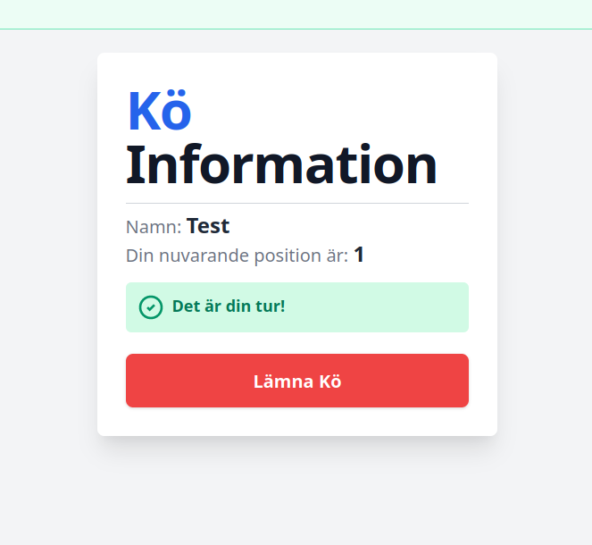
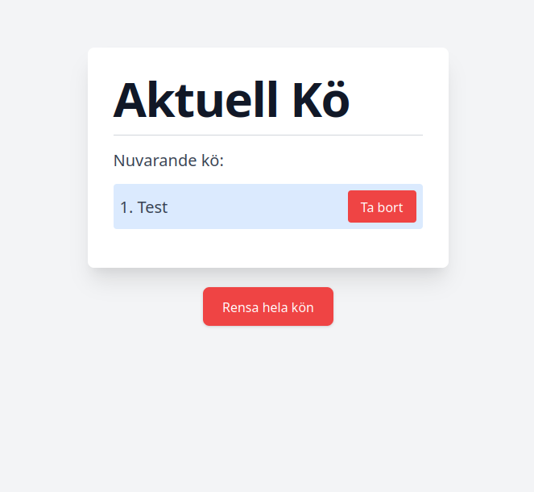
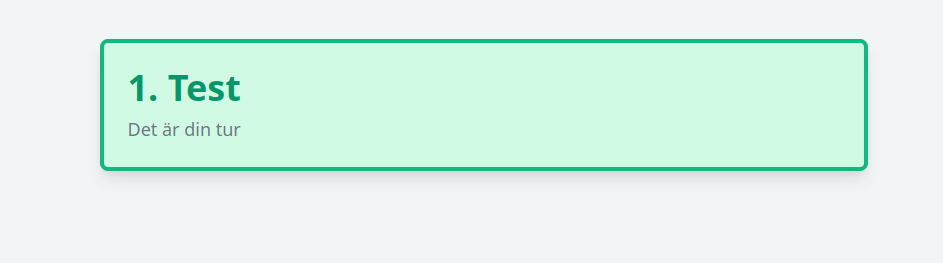

# Digital Queue Management System

## Description

`Digital Queue Management System` is a modern and efficient queue management system. With its intuitive design, users can quickly view their position in the queue and receive real-time updates.

This is very useful for managing queues in a variety of settings, such as:
- school classrooms,
- university lecture halls,
- restaurants,
- and more!

## Features
- Route for the admin to control the queue
- Route for the user to view their position in the queue
- Real-time updates on all the routes

## Screenshots






## Installation

1. **Clone the repository**:
   ```
   git clone https://github.com/ismail424/VirtualQueue
   ```

2. **Navigate to the project directory**:
   ```
   cd VirtualQueue
   ```

3. **Install the required dependencies**:
   ```
   pip install -r requirements.txt
   ```

4. **Run the application**:
   ```
   python app.py
   ```

## Usage

After installation, open your web browser and navigate to `http://localhost:5000` to view the main page. Follow the on-screen instructions to add or remove students from the queue.

## Contributing

If you're interested in contributing to this project, please create a pull request with your proposed changes. All contributions are welcome!

## License

This project is licensed under the MIT License. For more details, see the `LICENSE` file in the repository.

